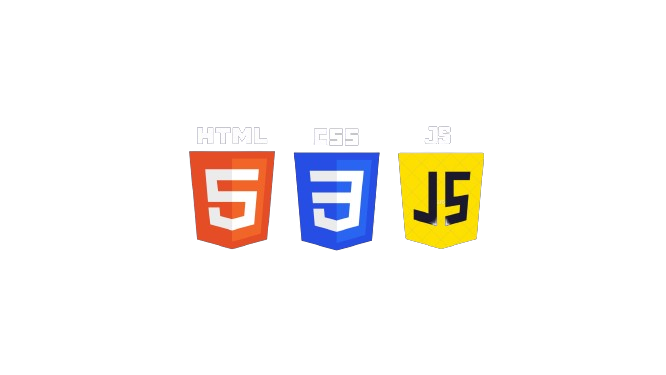

# Estudo de Front-End

## Objetivo

O objetivo desse repositório é armazenar meus estudos de Front-End, que incluem diversas tecnologias

## Tecnologias atualmente vistas
- [x] HTML
- [x] CSS
- [x] Bootstrap 5
- [x] JavaScript
- [ ] UI/UX Design

### Bibliotécas e Frameworks de JavaScript vistos
- [ ] Jquery
- [ ] Angular
- [ ] Flutter
- [ ] React
